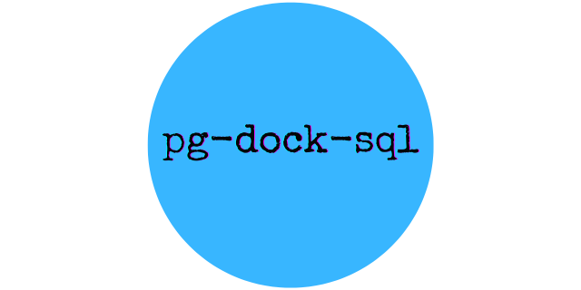
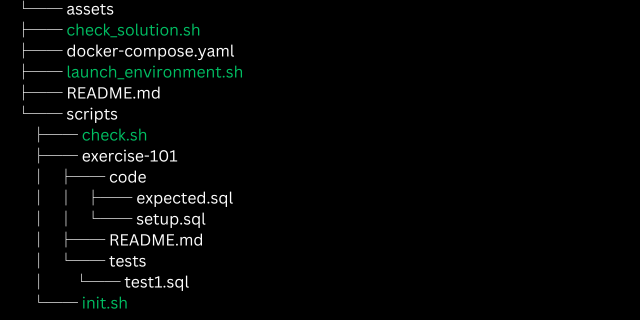

# pg-dock-sql
Refine your SQL skills using **pg-dock-sql**—a PostgreSQL Docker environment for hands-on coding challenges and solutions. This helps to elevate your proficiency in SQL through handson experience.

<p align="center">
 </img>
</p>


### Pre-Requisites
- **_docker_** (https://docs.docker.com/engine/install/)
- **_docker-compose_** (Refer to https://docs.docker.com/compose/)
- **_Visual Studio Code_** 
    - This is optional for local SQL development and debugging against the postgres docker container using an IDE.
- **_PGSQL Plugins for VSCode_**
    - This is optional.


### Setup
- Clone the repository to your local machine
    ``` 
    git clone git@github.com:sibyabin/pg-dock-sql.git
    cd pg-dock-sql
    ```
    
    The directory will look like the below.

  
- Set below environment variables in your terminal
    ```
    export POSTGRES_DB=practise
    export POSTGRES_USER=dbuser
    export POSTGRES_PASSWORD=<password>
    ```
### Launch the environment
- Run the command `sh launch-environment.sh`
    

### Verify Installation
- Run `docker ps` command to check if the container started without issues
    
- Run below commands against the container to check whether the all the exercise schemas and tables are created 
    ```
    docker exec -it postgres psql -v --username dbuser --dbname practise -c "\dn"
    ```
    

## How to extend?

### Create artifacts required
Under scripts folder , create a folder structures in the format `exercise-<some_number>`.
For e.g., `example-111`
```
    ├── exercise-111
    │   ├── code
    │   │   └── setup.sql
    │   │   ├── expected.sql
    │   │   └── solution.sql
    │   ├── README.md
    │   └── tests
    │       └── test1.sql
```

- **_README_**: This can be used to document the details of the problem. Test data to be used etc.
- **_setup.sql_**: This SQL can be used to create the required tables and then seed the test data.
- **_expected.sql_**: This SQL contains the expected output
- **_solution.sql_**: This SQL contains the solution to the problem implemented.


### Validating your solution
Execute the command `sh check-solution.sh <some_number>` on your system to validate the solution. This script will establish a connection with the PostgreSQL Docker container, execute your provided solution, and display both the expected and actual outputs. _some_number_ can be any number between 101 to 200


### Stop the environment
Execute the command `sh stop-environment.sh` to halt the containers when you are not actively working on them.

#### Cleanup the environment

Execute the command  `sh cleanup-environment.sh` to cleanup the environment (containers, networks, images, volumes etc) permanently.

--- 
